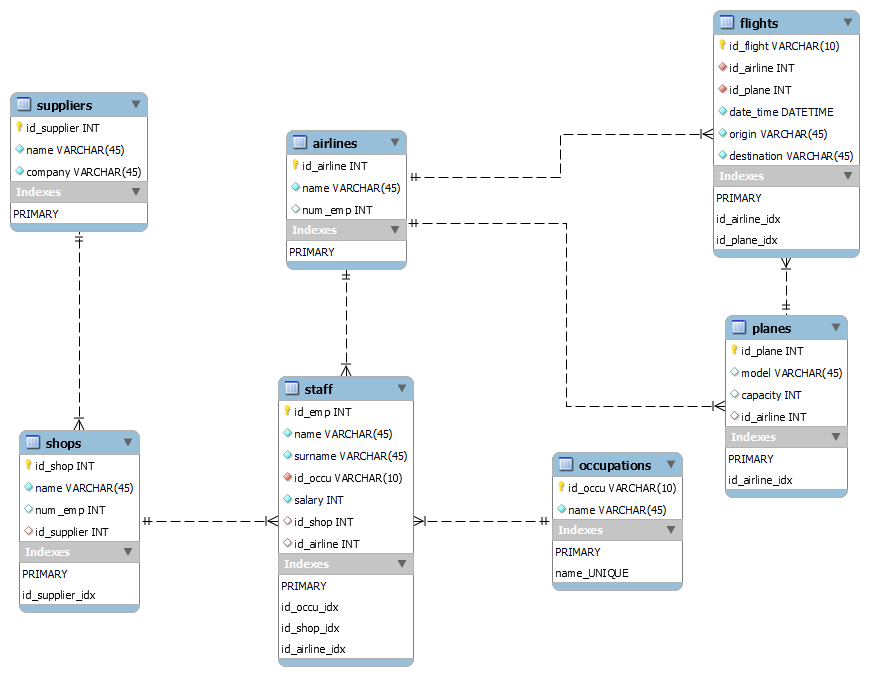
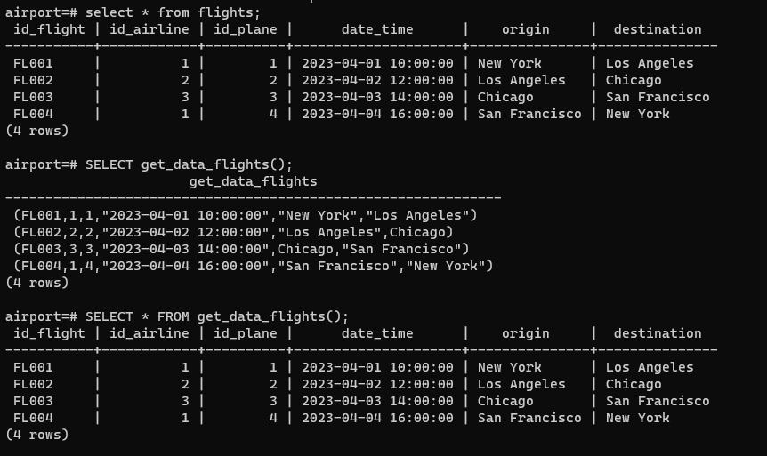
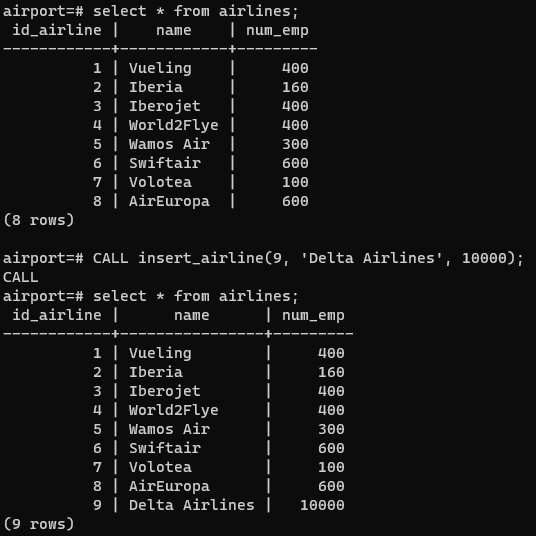
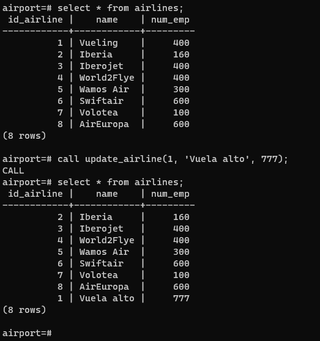
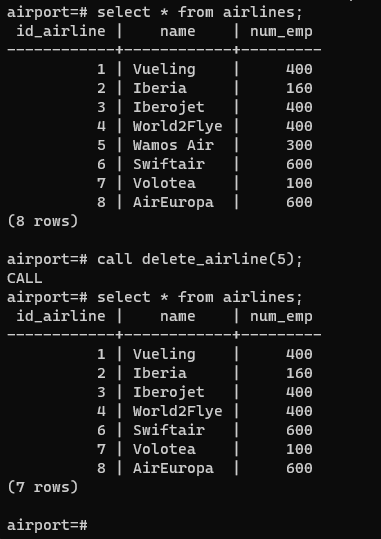

# PostgresSQL PL/pgSQL

**Table of contents**

- [PostgresSQL PL/pgSQL](#postgressql-plpgsql)
  - [Introduction](#introduction)
  - [Database schema](#database-schema)
  - [How to install](#how-to-install)
  - [How to use](#how-to-use)
    - [Functions](#functions)
    - [Procedures](#procedures)

## Introduction

This is an assigment for the Databases assignature. Our task was to create a project of our choice with at least one function, one procedure, one cursor, and one trigger using PL/pgSQL.   

We decided to set up a PostgreSQL database in a Docker container with a `docker-compose.yaml` file and create a serie of SQL scripts to create all that was needed and which will be executed automatically upon creating the database's container using volumes (which will also help the data to persist even if the container is deleted).   

## Database schema



## How to install

You will need `Git` and `Docker`.   

1. Open the terminal and clone the repository in the directory you wish:   

    ```
    git clone https://github.com/ncocana/PostgreSQL-PLpgSQL.git
    ```

2. Initialize Docker and, inside the directory of the repository, write the command:

    ```
    docker-compose up
    ```

    The Docker container with the PostgreSQL database is now executing. Upon exxecution, the container will run the SQL scripts and create the needed database, tables, functions, procedures, and triggers.   

## How to use

1. Open another window in the terminal and enter the container with the command:   

    ```
    docker exec -it postgresql_compose psql -U user
    ```

2. Navegate inside the database `airport`.

    ```
    \c airport
    ```

    Other useful commands are:   

    - `\l`: To see the databases.
    - `\c [database]`: To change to the database of your choice. Ex.: `\c airport`.
    - `\dt`: To see the tables.
    - `select * from [table]`: To see the content of a table. Ex.: `select * from flights`.

### Functions

To execute the functions, write them like this:   

```
select * from function(parameters);
```

`function` being the name of the function, and `parameters` being the type of parameters needed by the function (which will be specified below).   

**Get specific data**

- `get_large_airlines_name(int)`: Get the airlines' name where the number of employees is more than X.
- `get_larger_airlines_data(int)`: Get the airlines' name and number of employees where the number of employees is more than X.
- `get_flights_by_airline_id(int)`: Get the number of flights of a given airline by the airline's ID.
- `get_specific_employees(varchar(8))`: Get the ID, name, salary, occupation, and work place's ID of each employee in a given work place, which can be `shop`/`shops` or `airline`/`airlines`.
- `get_large_planes(integer)`: Get the ID, model, and capacity of a plane given the minimun capacity of a plane.
- `get_shops_by_range(integer, integer)`: Get the shop's ID, name, and number of employees where the number of employees is between the range of the two numbers given.
- `get_initial_j_name()`: Get the suppliers' ID, name, and company where the name begins by `J`.

**Get all the data**

- `get_data_airlines()`: Get all the data from the `airlines` table.
- `get_data_flights()`: Get all the data from the `flights` table.
- `get_data_occupations()`: Get all the data from the `occupations` table.
- `get_data_planes()`: Get all the data from the `planes` table.
- `get_data_shops()`: Get all the data from the `shops` table.
- `get_data_staff()`: Get all the data from the `staff` table.
- `get_data_suppliers()`: Get all the data from the `suppliers` table.



### Procedures

To execute the procedures, write them like this:   

```
call procedure(parameters);
```

`procedure` being the name of the procedure, and `parameters` being the type of parameters needed by the procedure (which will be specified below).   

There are three types of procedures: `insert`, `update`, and `delete`.

<p align="left">



</p>

**Table `airlines`**

- `insert_airline(integer, varchar(45), integer)`: Insert a new entry in the `airlines` table.
- `update_airline(integer, varchar(45), integer)`: Update an existing entry in the `airlines` table.
- `delete_airline(integer)`: Delete an existing entry in the `airlines` table by its ID.

**Table `planes`**

- `insert_plane(integer, varchar(45), integer, integer)`: Insert a new entry in the `planes` table.
- `update_plane(integer, varchar(45), integer, integer)`: Update an existing entry in the `planes` table.
- `delete_plane(integer)`: Delete an existing entry in the `planes` table by its ID.

**Table `suppliers`**

- `insert_supplier(integer, varchar(45), varchar(45))`: Insert a new entry in the `suppliers` table.
- `update_supplier(integer, varchar(45), varchar(45))`: Update an existing entry in the `suppliers` table.
- `delete_supplier(integer)`: Delete an existing entry in the `suppliers` table by its ID.

**Table `shops`**

- `insert_shop(integer, varchar(45), integer, integer)`: Insert a new entry in the `shops` table.
- `update_shop(integer, varchar(45), integer, integer)`: Update an existing entry in the `shops` table.
- `delete_shop(integer)`: Delete an existing entry in the `shops` table by its ID.

**Table `occupations`**

- `insert_occupation(varchar(10), varchar(45))`: Insert a new entry in the `occupations` table.
- `update_occupation(varchar(10), varchar(45))`: Update an existing entry in the `occupations` table.
- `delete_occupation(varchar(10))`: Delete an existing entry in the `occupations` table by its ID.

**Table `staff`**

- `insert_staff(integer, varchar(45), varchar(45), varchar(10), integer, integer, integer)`: Insert a new entry in the `staff` table.
- `update_staff(integer, varchar(45), varchar(45), varchar(10), integer, integer, integer)`: Update an existing entry in the `staff` table.
- `delete_staff(integer)`: Delete an existing entry in the `staff` table by its ID.

**Table `flights`**

- `insert_flight(varchar(10), integer, integer, timestamp, varchar(45), varchar(45))`: Insert a new entry in the `flights` table.
- `update_flight(varchar(10), integer, integer, timestamp, varchar(45), varchar(45))`: Update an existing entry in the `flights` table.
- `delete_flight(integer)`: Delete an existing entry in the `flights` table by its ID.
